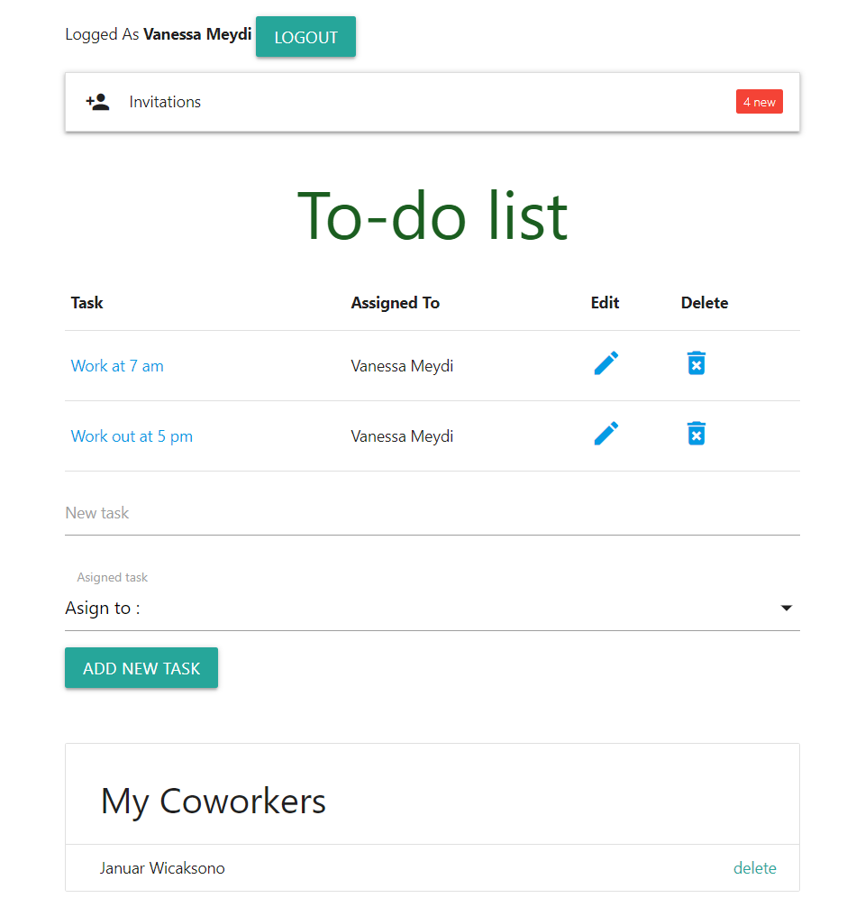

	<h2>Todo Application Web Base Using Laravel</h2>

This is my source code training about build Todo Application Web Base Using Laravel

	<h2>Tools Used</h2>

<ul>
	<li>Chrome</li>
	<li>Xampp</li>
	<li>HeidiSQL</li>
	<li>Visual Studio Code</li>
	<li>Git</li>
	<li>Composer</li>
</ul>

	<h2>Laravel Feature Used</h2>

<ul>
	<li>Eloquent</li>
	<li>Migration</li>
	<li>Soft Deleting</li>
	<li>Pagination</li>
	<li>Cache</li>
	<li>User Authentication</li>
</ul>

	<h2>Third Party Library</h2>

<ul>
	<li>MaterializeCSS</li>
</ul>
